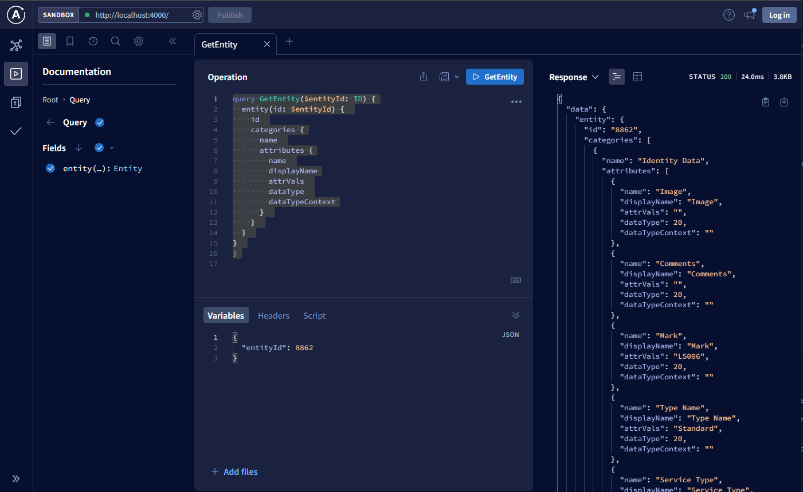

# Takehome Readme

This project was bootstrapped with [Create React App](https://github.com/facebook/create-react-app). 

## Project Layout

### ResolveBackend

This project is the backend core of the app.  It is an [apollo-server](https://www.apollographql.com/docs/apollo-server/) that is returning back graphql queries.  

#### Starting Backend

```
cd resolveBackend
npm start
open http://localhost:4000/
```

You can preview the server response via the graphql interface


### Why graphql?

1. I thought that downloading and parsing the database would result in more overhead than it did.  The graphql apollo client for the web-client has mechanisms in place to handle long loads for long duration queries.  This turned out to be a non-issue but this demo could support larger downloads and delays between responses due to the "loading" state
2. I'm code generating all the types from the structure (of which the data is easily structured and rationalized via the graphql queries) -- this allows for auto complete on both the server and the client when it comes to the data model.  
3. The apollo server is letting me just have an async function and handling all the state management of the query for me.  The extra overhead of doing it in graphql was worth it for this abstraction.
4. The apollo client auto caches queries as per one of the line items in the nice to haves ;).  Also there's the possibility to add caching to the backend as well if it was to be extended / if we talk about it.


#### Starting Frontend
(make sure backend is running)
```
cd resolve-frontend
npm start
(browser should auto launch to the site) localhost:3000
hit the fetch button or enter another entity id to fetch a different entity.
```

#### Testing

I unfortunately did not have time to implement testing :(.  This is very uncharacteristic of me.  I made a tradeoff to get all the typing working.